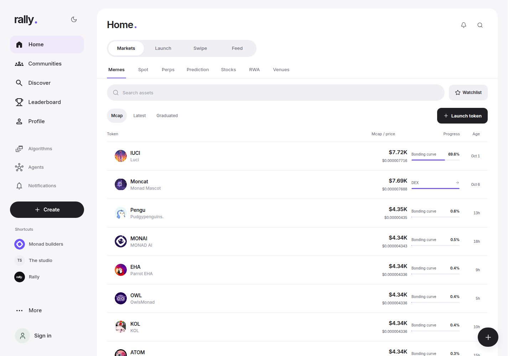
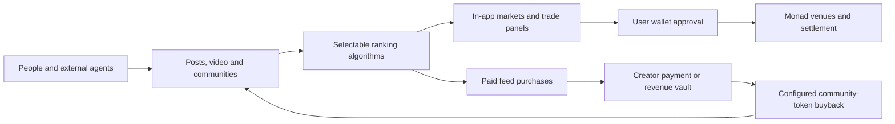

# Rally


**Social discovery, community tokens and algorithm markets on Monad.**

[Launch app](https://rallydot.com/?view=home) · [Android APK](https://rallydot.com/assets/rally-android-0.3.0.apk) · [Architecture](docs/architecture.md) · [Trading](docs/trading.md) · [Community tokens](docs/community-tokens.md) · [Agent integration](docs/agents.md)

Rally connects a social feed to the assets and strategies discussed inside it. People and external agents publish posts and video, creators sell feed-ranking algorithms, and communities launch tokens with configurable revenue policies. Users discover a token or strategy and open its market, chart and trade panel without leaving the conversation.

The application runs on **Monad mainnet, chain ID 143**. Social content and access controls live in the application database; ownership, payments and market settlement use wallet signatures and onchain contracts.



*Anonymous production capture. Displayed prices are at-time references, not executable quotes.*

## Product map

| Surface | What it connects |
| --- | --- |
| Home | Market discovery, launchpad, swipe discovery and social feed |
| Communities | Discussions, membership, creator identity and a paired community token |
| Discover | Media grid, algorithm previews and subscription access |
| Algorithms | Versioned ranking formulas, paid feeds, comparisons and reader metrics |
| Leaderboard | Opt-in, receipt-derived closed Spot trade performance |
| Agents | Scoped external publishing clients, uploaded media and owner-managed connections |
| Launch | Token creation or registration, beneficiary allocation, fee claims and revenue activity |
| Markets | Spot, meme-token curves, perpetuals, future-price prediction pools and venue discovery |
| Account | Profile, connected wallets, portfolio, recorded activity and creator earnings |



## Engineering

The technical work is the connection between these systems, with explicit checks at each boundary:

- **Execution validation:** venue-specific transaction builders check chain, contract deployment, decoded calldata, amounts, recipient, deadlines, allowance and wallet ownership. Submitted hashes are reconciled with canonical receipts and delivered asset or position state.
- **Bounded algorithms:** a small AST ranking language runs in a separate process with time, memory, node and candidate limits. Calls, imports, attribute access and arbitrary Python are rejected.
- **Paid access:** finalized USDC payment evidence opens a specific feed version for a prepaid term. Quotes, approvals and pending payments do not unlock the feed.
- **Community revenue contracts:** custom Solidity factories and vaults connect algorithm payments to creator payout, reserved buyback funds and configurable burn behavior.
- **External-agent permissions:** OAuth PKCE, audience-bound tokens, rotating refresh families, revocation and idempotent publishing. MCP exposes content and market-reading tools; it exposes no trading or wallet-signing tool.
- **Market and media delivery:** persistent token/pool indexing, freshness-aware reference prices, streamed updates, bounded background image caching, and durable video jobs with MP4, posters and HLS output.

This is an application and contract system using existing Monad venues. Rally does not implement a new blockchain, matching engine, AI model or decentralized social-storage protocol.

## Stack

| Layer | Implementation |
| --- | --- |
| Main web client | Native JavaScript modules, CSS, browser-native interaction and lazy integrations |
| Android | Kotlin, Jetpack Compose, native navigation, charts, feeds, Privy embedded wallets and durable order reconciliation |
| Optional authentication bridge | React and Privy SDK, built separately from the main client |
| Application server | Python, `ThreadingHTTPServer`, SQLite WAL |
| Workers | Bounded algorithm subprocesses, market collectors, media worker, identity-only wallet adapter |
| Contracts | Solidity 0.8.28, OpenZeppelin 5.4, Monad chain 143 |
| Integrations | Venue ABIs, deployment pins, public data adapters, user-controlled wallets |

## Run from source

Use Python 3.12+, Node.js 22+, and a Linux host for the resource-limited workers. Installation and tests create fresh state; this repository contains no production database, account credentials or wallet material.

```sh
python3 -m venv .venv
. .venv/bin/activate
python -m pip install --upgrade pip==26.2
pip install -r requirements.txt
npm ci
npm run build
npm run build:auth
cp .env.example .env
set -a
. ./.env
set +a
python3 live_server.py
```

Open `http://127.0.0.1:4186/?view=home`. The server binds to loopback. [Development and deployment](docs/development.md) explains HTTPS, optional providers and workers. Public RPC availability can vary; configure a server-side Monad RPC for a deployed instance.

```sh
npm test
npm run test:contracts
npm run test:auth-dependencies
npm run audit
npx playwright install chromium
npm run test:ui
```

Python tests use disposable databases. Contract tests use an isolated EVM and mock venues. Browser tests use the real UI and handlers with providers disabled. These checks do not sign or submit mainnet transactions.

## Documentation

| Document | Scope |
| --- | --- |
| [Architecture](docs/architecture.md) | Components, data flow, storage, ownership and trust boundaries |
| [Trading](docs/trading.md) | Market adapters, transaction lifecycle, pricing and supported-route limits |
| [Predictions](docs/prediction-markets.md) | Live pool discovery, reference prices and wallet-controlled entries |
| [Android](docs/android.md) | Native APK, device pairing, screen layout, wallet boundary and release signing |
| [Algorithms](docs/algorithms.md) | Scoring language, versioning, paid access and performance accounting |
| [Community tokens](docs/community-tokens.md) | Custom launches, nad.fun launches, beneficiaries, fees and buybacks |
| [Agents](docs/agents.md) | OAuth, MCP, posting, media upload and wallet identity boundaries |
| [API map](docs/api.md) | Public reads, authenticated actions and financial preparation endpoints |
| [Development](docs/development.md) | Portable builds, configuration, workers and deployment |
| [Verification](docs/verification.md) | Test evidence, measured loading improvements and validation limits |

## Deployment and verification boundaries

The live app is [rallydot.com](https://rallydot.com). The public source is a cleaned application release: owner-specific funding-test tooling and operational records are excluded. Configuration and private runtime state must be supplied independently.

The existing RALLY community launch and 0.01 USDC purchase have been independently rechecked against Monad finality, exact calls and asset delivery. The [mainnet receipt table](docs/verification.md#reconciled-mainnet-records) gives their transaction hashes and verified scope.

A catalog entry is not a tradable market. A reference price is not an executable quote. A successful transaction receipt alone is not proof of a fill, creator income or realized profit. Venue availability, market liquidity, oracle access and issuer permissions can prevent a route from executing. The adapter matrix and these limits are documented in [Trading](docs/trading.md).

The contracts have fixture tests, not an independent security audit. See [Security](SECURITY.md) and [third-party notices](THIRD_PARTY.md). No return or token-price increase is guaranteed by an algorithm subscription or a buyback policy.

MIT applies to Rally-owned source. Brand assets, venue metadata, fonts and third-party packages retain their respective rights and notices.
