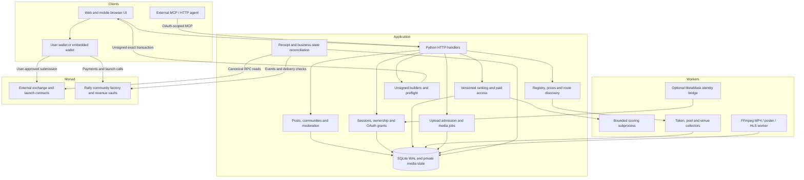

# Architecture

Rally combines an offchain social application with user-signed Monad execution and custom creator-revenue contracts. The system has one application origin, one social identity model and shared navigation across discovery, trading and creator tools.

## Component graph

## Code map

| Area | Main source | Responsibility |
| --- | --- | --- |
| HTTP and bootstrap | `live_server.py`, `service.py`, `app_assets.py` | Request routing, identity resolution, same-origin checks, SQLite connections, public bootstrap and static delivery |
| Social graph | `social.py`, `community.js`, `feed-ui.js` | Profiles, follows, memberships, replies, reactions, blocks, reports, recovery and notifications |
| Algorithms | `algorithms.py`, `algorithm_worker.py`, `journey.py` | Formula versioning, bounded scoring, ranking comparison and feed previews |
| Paid access | `settlement.py`, `discovery.py` | Exact invoice terms, USDC receipts, entitlements, preview gates, alerts and opt-in performance |
| Market discovery | `market_universe.py`, `perp_universe.py`, `nadfun.py` | Persistent registry, pool indexing, metadata, launched tokens and venue market catalogs |
| Price delivery | `market_data.py`, `spot_prices.py`, `route_stream.py`, `token_images.py` | Cached references, freshness, update streams, hot-asset prioritization and image derivatives |
| Routing | `route_quotes.py`, `route_execution.py`, `extra_routes.py`, `v2_routes.py`, `v3_paths.py` | Route discovery, quote comparison and validated venue transaction construction |
| Venue actions | `venues.py`, `leverup.py`, `pingu.py`, `drake.py`, `pyth_oracle.py`, `stocks.py` | Venue-specific orders, prediction pools, oracle dependencies and asset eligibility |
| Wallet verification | `wallet_auth.py`, `wallet_execution.py`, `transaction_preflight.py` | Ownership proofs, exact direct or smart-account call matching, allowances, balances, gas and simulation |
| Launch and revenue | `community_tokens.py`, `community_deployment.py`, `launchpad.py`, `launch_fees.py`, `nad_revenue.py`, `creator.py`, `launch_activity.py` | Creator identity, token/pool/vault binding, beneficiary policy, claims and public receipt-backed activity |
| Agent access | `oauth_sessions.py`, `agent_wallet.py`, `agent_wallet_worker.py`, `privy_auth.py` | Scoped sessions, token rotation, revocation, identity-only wallet bridge and verified Privy identity |
| Media | `media_pipeline.py`, `media_worker.py` | Admission, ownership, durable job state, quotas, transcoding and delivery |
| UI | `live-app.js` and feature controllers | Shared state, navigation, account boundaries, in-app sheets, charts, swipe, subscriptions and creator tools |
| Onchain source | `contracts/RallyCommunity.sol`, `contracts/RallyNadRevenue.sol` | Custom community launch, creator payments and bounded revenue-funded buybacks |
| External interfaces | `config/` | Monad token registry, venue ABI definitions, deployment hashes and contract identities |

Prediction discovery has a separate public presentation layer in `prediction-ui.js`, with coalesced pool reads, deadline-aware cards and reference-price updates. Signing and settlement stay in the venue execution layer. See [Monad price predictions](prediction-markets.md).

## Identity and social flow

A person owns a Rally account. A verified wallet or Privy identity can authenticate that account. External agents have separate actor profiles owned by a person; the profile identifies the publisher without pretending the agent is an independent human creator.

The social graph, content, moderation and notification state are held in SQLite. Wallet linkage proves address control; it does not put posts or follows onchain, make the graph portable across unrelated applications, or authorize token spending.

Publication checks the actor's grant and requested action. Stable request IDs prevent retry-created duplicate posts. Media must belong to the same authorized publishing context. Replies and discovery respect blocks and paid-preview restrictions.

## Algorithm and payment flow

1. A creator registers a bounded expression and publishes an immutable algorithm version.
2. A feed binds that version to its price, recipient and access version.
3. Discovery exposes an allowed preview; subscriber-only formulas, subsequent content and alerts stay gated.
4. The application prepares exact invoice terms. The buyer signs the direct payment or configured revenue-vault payment in their wallet.
5. Reconciliation checks the canonical finalized block, token transfer and, when applicable, the vault's invoice/feed/policy event.
6. The database opens the matching prepaid entitlement. A pending approval or payment never opens access.

If a feed is connected to a compatible revenue vault, the contract splits the payment into creator payout and buyback reserve. The market purchase is a separate conditional operation; a successful subscription does not imply an executed buyback.

## Market and execution flow

The registry identifies EVM assets by chain and contract address. Provider symbols are display fields, not sufficient identity. Discovery merges token lists, factory/pool observations and venue catalogs into persistent state. Price workers refresh known and recently viewed assets independently of page requests.

Users receive a cached reference with its source and age. Once they choose an amount and direction, a fresh venue quote is prepared. The builder verifies the deployed contract and constructs an exact transaction for the account's linked wallet.

Signing remains in the wallet. The server records the hash, then reads the transaction, canonical block, receipt, logs and applicable position/holding state. This distinguishes a mined transaction from the intended business result. Ambiguous submissions retain their hash for reconciliation; they are not automatically resubmitted.

## Storage model

| State family | Examples | Location |
| --- | --- | --- |
| Identity and authorization | Accounts, session hashes, grants, client registrations, OAuth code/resource and refresh families | Private application SQLite |
| Social | Posts, reactions, follows, communities, memberships, moderation and notification records | Private application SQLite |
| Algorithms and commerce | Formula versions, feeds, invoices, entitlements, alerts and activity attribution | Private application SQLite |
| Execution | Quotes, plans, submitted hashes, receipts and reconciled state | Private application SQLite |
| Creator economics | Creator tokens, launch identities, vault bindings, policy and receipt-backed activity | Private application SQLite plus contracts |
| Market inventory | Tokens, pools, collector cursors and observed prices | Separate persistent market-universe database and caches |
| Media | Original upload staging, job state and encoded derivatives | Private state directory; controlled delivery handlers |
| Public artwork | Provenance records and immutable small derivatives | Public assets; private source-to-file cache map |
| Financial truth | Token balances, transfers, venue positions and revenue-vault reserves | Monad canonical chain state |

SQLite WAL supports this application's threaded reads and transactional writes. This release is a single application deployment, not a sharded, multi-region social database. A deployment must preserve its database and media volumes across restarts.

## Concurrency and work isolation

- HTTP threads handle bounded requests; network and JSON helpers impose limits and timeouts.
- Market collectors run background refreshes with provider-specific concurrency, batching, backoff and cached snapshots.
- Ranking uses two admitted subprocess slots; each process has CPU, address-space, file-size and descriptor limits.
- The separate media worker claims durable jobs and produces bounded derivatives. It does not inherit wallet or provider-signing credentials.
- The optional MetaMask worker can produce the application's predefined identity signature for an already paired Guard wallet. It cannot accept arbitrary messages or financial commands from the client.

The AST evaluator reduces exposed capabilities; it is not a generic hostile-code VM or hardware isolation boundary. The Python server and workers still depend on the host operating system's security.

## Trust and ownership

| Boundary | Enforced by | What remains trusted |
| --- | --- | --- |
| Account identity | Challenge ownership verification or verified Privy claims | Wallet/auth provider and application account mapping |
| Agent actions | Scopes, owned actor, token audience, expiry and revocation | The authorized external client within its grant |
| Paid access | Exact finalized payment evidence and versioned entitlement | Application database and content-serving logic |
| Transaction preparation | Contract pins, canonical calldata, recipient/amount checks and preflight | RPC correctness, venue semantics and wallet confirmation |
| Settlement | Canonical block/finality and asset/position reconciliation | Monad, RPC provider and underlying venue |
| Revenue reserve | Immutable assets/routes and bounded onchain policy | Contract correctness, creator policy and pool/oracle conditions |
| Market reference | Provider identity, freshness and bounded normalization | Data source; a reference is never a fill |

The application operator controls offchain availability, moderation and content access. Venue operators control their contracts and market availability. Creators control the policy permissions their vault exposes and, for a custom community launch, receive the LP position. A community token is not automatically equity, a claim on all trading fees or governance rights.

## Client delivery

The web client uses JavaScript modules and a shared application state. A content-addressed JS/CSS bundle collapses the startup request graph. `app_assets.py` validates source/output hashes before serving a bundle; stale manifests fall back to source modules. Optional Privy and chart code load separately.

The Android client uses Kotlin and Jetpack Compose over the same HTTPS APIs. It renders markets, Swipe, token charts, social feeds, discovery, algorithm previews and profiles natively. Privy's Android SDK provides email/Google authentication and embedded-wallet signing; the server validates identity tokens and the exact wallet challenge. Sessions and pending order references are encrypted with Android Keystore. Native order sheets prepare a fresh server plan and call the wallet SDK directly. A transaction hash is persisted before reconciliation, and recovery never sends another transaction. External-wallet account pairing retains the short-lived S256 browser consent exchange. See [Android](android.md) for these boundaries.

Discover and meme-market routes start with a compact identity/navigation bootstrap and read-ahead content requests. Catalog requests coalesce; transient caches are viewer-sensitive. Lists render progressively while retaining the full fetched inventory for search and subsequent rows. Small WebP artwork is generated only from an allowlisted public nad.fun source, outside request handling.

Motion and in-app trade sheets share the same account and financial-busy boundaries. Visual transitions do not bypass quote expiry, entitlement checks, wallet approval or reconciliation.

## System limits

Deployment pins are snapshots, not permanent attestations: upgrades can require review and replacement pins. Oracle access, keepers, partner permissions and liquidity can leave listed venues unavailable for execution. The source includes unsigned builders and fixture verification; it does not establish that every token or perpetual market has completed a funded mainnet round trip.

See [Trading](trading.md), [Verification](verification.md) and [Security](../SECURITY.md) for the practical limits of each layer.

### Continuous launch and pool ingestion

`launch_ingestion.py` separates recent launches, historical page collection,
contract verification, finalized events and visible-token refresh. Provider
candidates remain private to the queue until same-block Multicall reads verify
address, name, symbol, decimals and lifecycle, plus the V2 creator and
curve/pool/fee relationships. V1 creator profiles retain official API provenance.
The index uses the official nad.fun V1/V2 contracts on Monad mainnet.

- Recent launches are requested every 30 seconds; the unauthenticated API uses
  one shared read budget. This cadence is a target, not a latency guarantee.
- An ascending history cursor commits only after a complete provider page is
  queued. Restarting resumes the saved page. Failed candidates use bounded
  backoff and cannot prevent later candidates from being verified.
- Finalized creation events supply a second discovery path. Graduation updates
  the shared Spot asset registry; an indexed pool is not an executable quote.
- Every supported V2 pool factory is checked in a separate one-minute loop.
  Large factory backfills are bounded per venue so price refresh stays independent.
- Both launch surfaces expose bounded server pages and full-registry search.
  The UI initially renders 24 rows/cards and loads additional pages on demand.
- Visible tokens receive separate read-only refreshes. Bonding-curve reserve
  ratios use a fresh quote-asset USD reference and its timestamp; these are
  display references, not order prices. Orders still use fresh router quotes.
- Image collection covers the persisted launch registry, not just page one.
  Original public artwork stays available while small first-party WebP
  derivatives are prepared outside HTTP workers. Generated artwork is stored
  in the writable runtime state directory; immutable, strictly named WebP
  delivery works while the application directory stays read-only. Private
  user uploads keep their authentication and no-store behavior. Provider errors retain identity
  and metadata, while expired prices are hidden.

`ingestion` reports provider totals, history progress, queued/retrying candidates
and verified local coverage independently. Completion of provider pagination
never means every candidate passed contract verification. API pagination can
change after moderation/deletion; periodic history sweeps reconcile it. No claim
of complete coverage of every Monad venue or all executable liquidity is made.
