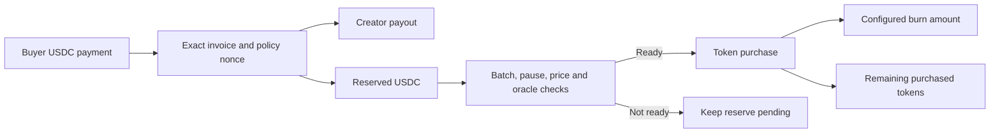

# Community tokens and creator revenue

Rally links a creator identity, community, token and algorithm feed. Token ownership does not itself grant rights to every fee, equity, governance or guaranteed appreciation. Those effects depend on a specific contract and configured revenue path.

## Two launch paths

| Path | Engine | Rally's own layer |
| --- | --- | --- |
| Custom community token | `RallyCommunityFactory`, V2 router/pair and `RallyCommunityVault` | Identity, image, launch planning, exact approval, canonical activation and algorithm revenue binding |
| nad.fun token | External nad.fun launch/curve/router and supported fee vaults | Owned human/agent launch identity, beneficiary allocation, lifecycle discovery, fee claim UI and optional Rally revenue vault |

The custom factory enforces Monad chain 143 and one community vault per creator wallet. It mints a fixed billion-token supply, seeds the entire supply into the requested token/USDC liquidity pool and transfers the LP position to the creator. It has no public mint or transfer-tax mechanism. **The creator receives LP ownership; this does not lock liquidity.** The launch rejects partial seed use and clears temporary router allowances.

`community_tokens.py` activates the social token binding only after matching canonical finalized launch evidence and deployed interfaces. A successful unrelated allowance, hash or contract deployment is insufficient.

## nad.fun beneficiaries and fee claims

`launchpad.py` validates an owned person or owned-agent identity and a fee-allocation policy totaling 10,000 basis points. A beneficiary can be an X or GitHub handle with a positive gift allocation; other allocations target the supported creator, burn or liquidity vault.

The application pins the external vault interfaces and targets. Beneficiary identity authentication and eligibility are enforced by the external integration, not by accepting a typed handle as proof of account ownership. Registration, claimability and a completed payout are separate states.

`launch_fees.py` builds exact claim calls and reconciles native delivery or token transfer evidence. A submitted claim is not presented as received income. The external vault's account-authentication and claim prerequisites must still be met.

## Algorithm-sale revenue vaults

`RallyCommunityVault` routes algorithm payments to a custom community token. `RallyNadRevenueVault` routes algorithm payments to a specified external nad.fun token. Both use immutable asset/route identities, creator-controlled policy, invoice replay protection and a policy nonce.

For a payment of `amount`:

```text
buyback reserve = floor(amount × buybackBps / 10,000)
creator payout  = amount − buyback reserve
burn allocation = configured portion of tokens actually purchased
```

Burn percentage applies to the purchased tokens, not to the USDC payment or all token supply. Trade fees from external exchanges are a different revenue source; creating a normal DEX pool does not automatically pay those fees to this algorithm-revenue vault.



The contract attempts a bounded self-call during payment if conditions permit. Failure of that buyback attempt leaves the reserve intact and does not roll back the subscription payment. Later `executeBuyback` calls can consume eligible reserve under the same limits. The application server has no general-purpose signing key or arbitrary keeper-call authority.

### Price protection

The custom vault uses pair cumulative prices with a 600-second observation window, a 1,200-second maximum age, spot/TWAP consistency, reserve participation limits, slippage, minimum batch and a creator-set maximum batch.

The external-token vault buys USDC→WMON through the configured V2 route, then WMON→the configured token through the pinned nad.fun route. The quote conversion uses a cumulative-price observation; the external token has a creator-configured minimum-token floor. That floor is a limit price, **not an independent oracle for the target token**. The vault requires exact WMON consumption and minimum token delivery.

Reserved buyback USDC cannot be swept by an arbitrary withdrawal method. Creator policy changes increment the nonce so a previously prepared payment cannot silently accept a changed allocation.

### Burn semantics

Custom community tokens expose an actual ERC-20 burn that reduces total supply. The external nad.fun revenue vault transfers its burn allocation to a fixed dead address; this is a sink transfer and does **not** call a supply-reducing token burn. Public activity must not conflate these two operations.

## Activity and accounting

`launch_activity.py` reads public finalized activity and independently validated payouts/buybacks. It keeps pending reserve, purchased tokens, creator receipts and claim deliveries distinct. The public view excludes private invoice, buyer and paid-content details; it does not sum amounts across unrelated currencies into fabricated revenue.

Contracts, launch UI, unsigned builders and fixture tests are included. A live launch or paid purchase requires the appropriate configured deployment, liquidity, wallet funds, signature and finality. No new tokens, fees or creator income are generated merely by cloning or building this repository.
