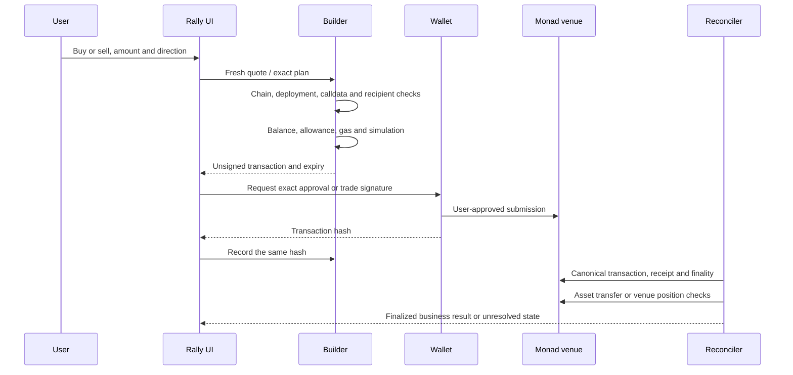

# Markets and execution

Rally routes to Monad venues; it does not operate their liquidity or matching engines. Discovery, reference pricing, executable quotes and delivered funds are separate layers.

## Adapter map

| Market family | Implementation | Execution boundary |
| --- | --- | --- |
| Spot aggregation | Kuru/Kuru Flow, KyberSwap, Uniswap paths and additional V2/V3/venue adapters in `route_quotes.py`, `route_execution.py`, `extra_routes.py`, `v2_routes.py` | Fresh amount-specific quote, decoded exact transaction and verified deployment required |
| Meme launch curve and migrated tokens | `nadfun.py`, `launchpad.py` | Curve status, exact token identity, route availability and supported router version determine the path |
| Perpetuals | Perpl in `venues.py`; LeverUp, Pingu and Drake modules | Venue account/collateral rules, signed oracle inputs and keeper/market availability remain venue-specific |
| Predictions | Castora in `venues.py` | Future-price pool participation and settlement conditions; these are not Polymarket-style binary event books |
| Stocks and RWA | `stocks.py`, registry and partner metadata | Listed identity/reference data does not prove issuer permissions, redemption eligibility or an executable route |

The executable adapter set is declared in the source's provider dispatch tables. Catalog size changes with discovery; the system does not substitute a fixed number of markets for route validation. Unsupported, illiquid or stale inputs return an unavailable result rather than a fabricated quote.

### External dependencies

Drake order paths can require venue-accepted signed oracle data. An arbitrary free price feed cannot replace that signature. Pingu execution depends on the venue's operational keeper behavior. Anchored stock routes require applicable partner access and verified contract semantics. Castora needs an eligible pool. A token image or reference price does not resolve these dependencies.

Official integration references: [Kuru](https://docs.kuru.io), [Perpl](https://docs.perpl.xyz), [nad.fun integration source](https://github.com/Naddotfun/nadfun-v2-intergration). These external systems and interfaces can change; runtime deployment checks are the execution gate.

## Price data

`market_universe.py` persists address-based token and pool inventory. Factory cursors and bounded log queries expand coverage. Price collectors use cached provider or pool observations, hot-asset prioritization, source backoff and freshness timestamps. Meme references preserve curve/migration identity.

Charts are normalized reference series rendered inside the application. General spot-reference candles can come from a different exchange than the executable Monad venue; those candles are not that venue's order history. Chart and price APIs do not authorize a trade.

The UI distinguishes absent, stale and current references. A market cap, where supported, is a derived display metric; it is not depth, exit liquidity or achievable sale proceeds.

## Execution sequence

Approval and trade can be separate wallet requests when a token allowance is needed. A simplified Buy/Sell interface removes redundant application review steps; it cannot remove a venue's allowance requirements or the wallet's own approval/security policy.

## Important validation mechanisms

`route_execution.py` decodes provider calldata and checks the intended asset, input/output amounts, receiver, deadline and route. `venue_pins.py` and adapter-specific manifests compare deployed code and proxy implementation identity.

`transaction_preflight.py` checks funding and simulation before a wallet request. Gas estimates are bounded and included in the required native balance. Approval verification checks the exact token/spender/owner/amount; an unrelated approval cannot activate a launch or purchase.

`wallet_execution.py` accepts an exact direct call. For a smart-account wrapper, it requires a finalized canonical receipt and a bounded `callTracer` trace matching the outer transaction, with exactly one matching expected call. Spot, venue orders, community launches and subscription payments use this same boundary. Missing trace capability leaves the result unresolved rather than accepting a guessed wrapper.

Shared venue and subscription approval checks require finality plus exactly one nonremoved ERC-20 Approval event for the reviewed owner, token, spender and amount. Perpl collateral reconciliation binds the event to the wallet's exchange account at the transaction block and requires the corresponding exact AUSD transfer into the exchange or back to the wallet. Receipt decoding rejects removed logs, unexpected indexed topics and noncanonical ABI payloads. Venue reconcilers receive the wallet stored with the reviewed plan.

An observed hash is not automatically a successful order. Reconciliation must match the requested transaction and verify the applicable token delivery, pool/vault creation or position state. A reverted or noncanonical receipt cannot be promoted to delivered state. Keep unresolved hashes and check them again; do not blindly send a replacement.

## Mainnet status

`GET /api/mainnet` exposes bounded cached network/deployment/dependency checks. It is useful for interface status, not authority to spend and not a funded acceptance test.

Fixture simulations exercise inputs, failure paths and contracts with synthetic state. Read-only provider checks establish at-time deployment identity or quote availability. Finalized, independently reconciled transactions establish issuance, holdings, creator receipts or venue position changes for that record. See the specific [mainnet receipts](verification.md#reconciled-mainnet-records).
